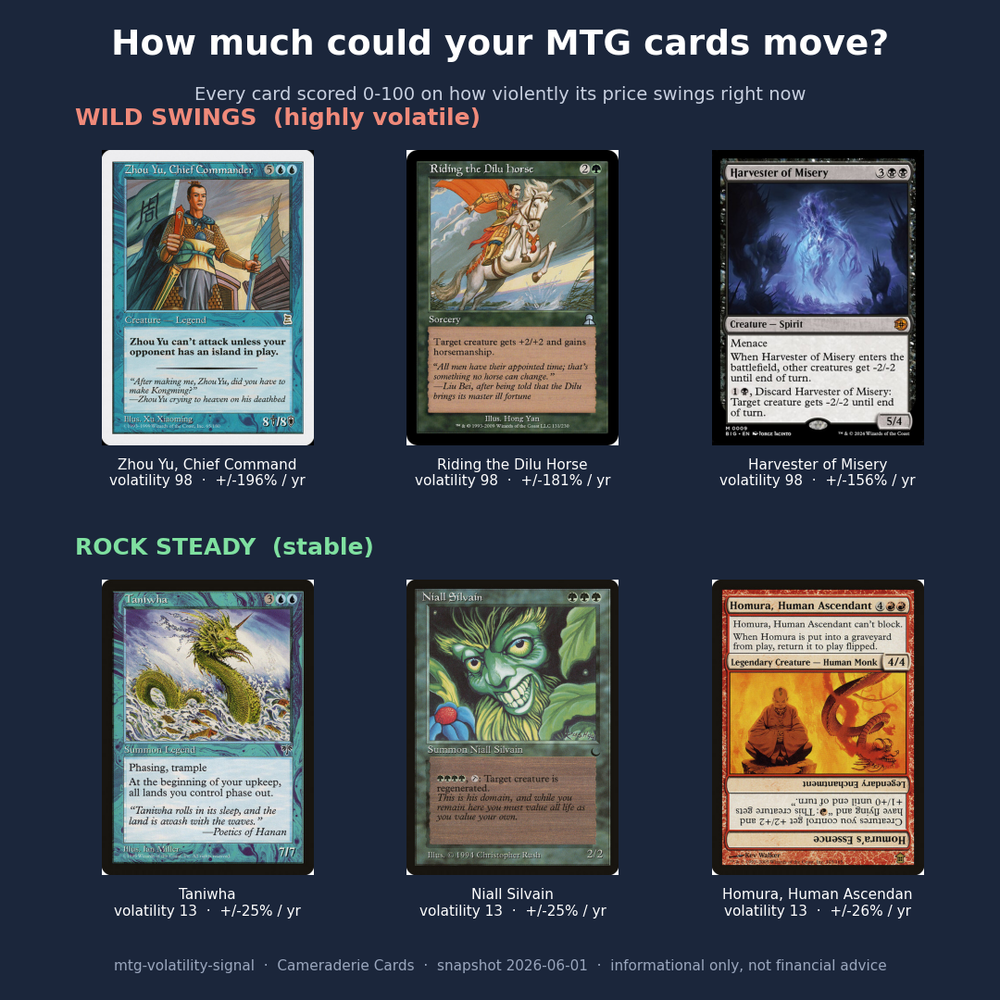

# mtg-volatility-signal

**A Current Volatility score for every Magic: The Gathering card: how much its price swings right now, not just which way.**
By Cameraderie Cards. Informational only, not financial advice.

> Part of the **Cameraderie Cards** toolkit: [`mtg-buy-signal`](https://github.com/rnorlund/mtg-buy-signal) · [`mtg-sell-signal`](https://github.com/rnorlund/mtg-sell-signal) · [`mtg-reprint-signal`](https://github.com/rnorlund/mtg-reprint-signal) · [`mtg-liquidity-signal`](https://github.com/rnorlund/mtg-liquidity-signal) · [`mtg-demand-signal`](https://github.com/rnorlund/mtg-demand-signal) · `mtg-volatility-signal` (you are here)

Every other model in this toolkit tells you *direction*: will a card rise, has it peaked, is it
about to be reprinted, can you sell it. None of them tells you *how far* a price could move. A card
that drifts 5% and a card that doubles or halves are completely different bets, even at the same
confidence. This model fills the **magnitude** gap. It scores all 30,538 tracked cards from 0 to 100
on **Current Volatility**: how violently the price swings right now, independent of which way.

The difference from its siblings: this score is **measured**, not a proxy index. It is computed
directly from each card's own price history as an annualized realized volatility, the same statistic
finance uses for risk.



## What goes into the score

Four measured components, blended into one number:

| Component | What it captures |
|---|---|
| **Realized volatility** | the annualized size of the card's weekly price moves, weighted toward recent weeks |
| **Drawdown** | its worst peak-to-trough fall, and how much of its movement is to the downside: the "how far down" |
| **Range** | the amplitude of its price swings relative to its price level |
| **Dispersion** | jump risk (its largest single-week move) and fat tails (how prone it is to sudden gaps) |

Two choices make the measurement honest. Volatility is read from a **single representative printing**
per card, never an average across printings (averaging across printings manufactures fake volatility
when a card's quoted editions change from day to day). And it is measured on **weekly** prices, not
daily, because Magic cards are thinly traded and daily marks are mostly discretization and stale-quote
noise. Weekly sampling diversifies that noise away while keeping the genuine moves.

## What it looks like

The most volatile cards are recent hyped specials and cards rocked by bans or buyouts. The most
stable are heavily-reprinted, deeply-played staples that barely move.

| Card | Volatility | Realized vol | 12mo expected move | Price |
|---|---|---|---|---|
| Dockside Extortionist | 96 | 189% | +/-150%+ | $15.26 |
| Mana Crypt | 89 | 60% | +/-80% | $52.00 |
| Alela, Cunning Conqueror | 97 | 170% | +/-115% | $8.10 |
| Sakashima the Impostor | 96 | 153% | +/-103% | $9.45 |
| The One Ring | 34 | 16% | +/-26% | $91.08 |
| Cyclonic Rift | 36 | 15% | +/-26% | $32.49 |
| Jace, the Mind Sculptor | 15 | 7% | +/-25% | $19.78 |

Notice Dockside Extortionist and The One Ring: both are expensive, sought-after cards, but one swings
in huge arcs (it has been banned and unbanned and bought out) while the other has been a steady
triple-digit staple. Same price tier, opposite risk. That gap is the whole point of measuring
volatility on its own.

See [`TechnicalPaper/REPORT.md`](TechnicalPaper/REPORT.md) for the full methodology, validation, and
limitations.

## The predictions

[`outputs/volatility_signal.csv`](outputs/volatility_signal.csv) is the deliverable, one row per card:

| field | meaning |
|---|---|
| `volatility_rank` | 1 = most volatile (global rank) |
| `oracle_id` | Scryfall oracle id (stable join key) |
| `name` | English card name |
| `price` | reference market price at scoring time |
| `volatility_score` | 0-100 Current Volatility score |
| `bucket` | Highly volatile / Volatile / Steady / Stable |
| `ewma_vol`, `vol_13w`, `vol_26w`, `vol_52w` | annualized realized volatility (recent-weighted, and over a quarter / half / year) |
| `forward_vol` | mean-reverting forward volatility used for the range bands |
| `max_drawdown`, `downside_semidev` | worst peak-to-trough fall and downside-only deviation |
| `range_robust`, `jump_abs`, `kurtosis` | swing amplitude, largest single-week move, fat-tail measure |
| `exp_move_3mo_pct`, `exp_move_6mo_pct`, `exp_move_12mo_pct` | expected +/- 1 sigma move over each horizon |
| `price_low_12mo`, `price_high_12mo` | the 12-month expected price band |
| `move_freq`, `stale_price` | fraction of weeks the price moves, and a flag for cards too stale to read |
| `is_imputed` | whether the score is imputed (too little price history to measure directly) |

## How it is validated

This is **version 1: a measured realized-volatility index, not an options-implied or supervised
forecast**. There is no options market for cards, so there is no implied-volatility ground truth to
fit. The honest question is whether a backward-looking measurement is a useful forward signal, and the
answer turns on one property: **does volatility persist?**

It does. We measure each card's volatility on the **first half** of its history and, separately, on the
**second half**, and check whether the first predicts the second. Across cards the rank correlation is
**0.44**, and the fitted slope is **0.32**. The second half is never seen when the first is computed,
so this is genuine out-of-time corroboration: a card that has been volatile stays volatile. The slope
well below 1 also tells us volatility is **mean-reverting**, so the expected-range bands deliberately
shrink today's most extreme readings toward the average rather than extrapolating them forever.

## Dated, falsifiable track record

[`track_record/`](track_record/) holds dated, immutable snapshots of past predictions, each with a
SHA-256 manifest so anyone can confirm later that we did not quietly rewrite history.

## What's in this repo (and what isn't)

| Open here | Held private |
|---|---|
| Methodology + technical report (PDF / DOCX / Markdown) | Data pipeline and feature code |
| Predictions (CSV / JSON) | Raw licensed price history |
| Validation outputs and figures | Daily refresh infrastructure |

## Honest limitations

- It measures **realized** volatility (how the card has moved) and uses it, via persistence, as a
  forward estimate. It is not an implied or guaranteed forward volatility, and persistence is moderate
  and mean-reverting, so the range bands are estimates, not promises.
- **Cheap cards carry residual noise.** A sub-$2 card shows more percentage wiggle than its small
  dollar moves justify, even after weekly sampling. Imagery and examples are restricted to cards over
  $3 for this reason.
- Volatility is read from **one representative printing**. Other printings of the same card (foils,
  old borders, collectible editions) can be far more or less volatile than the tracked copy.
- A **stale price looks stable**: a card no one trades shows little volatility because nothing
  reprices, not because it is genuinely calm. Those cards are flagged `stale_price`.

## Disclaimer

See [`DISCLAIMER.md`](DISCLAIMER.md). Short version: this is a model estimate of how much a card's
price swings, not a forecast of which way it will go and not investment advice.

## Citation

```
Cameraderie Cards. mtg-volatility-signal: a Current Volatility index for
Magic: The Gathering cards. 2026. https://github.com/rnorlund/mtg-volatility-signal
```

## Sibling repositories

| Repo | Question it answers |
|---|---|
| [`mtg-buy-signal`](https://github.com/rnorlund/mtg-buy-signal) | Which cards are likely to spike upward, when to **buy** |
| [`mtg-sell-signal`](https://github.com/rnorlund/mtg-sell-signal) | Which cards have peaked and are likely to fall, when to **sell** |
| [`mtg-reprint-signal`](https://github.com/rnorlund/mtg-reprint-signal) | Which cards are at risk of being reprinted, when to **brace** |
| [`mtg-liquidity-signal`](https://github.com/rnorlund/mtg-liquidity-signal) | How easily a card can be turned into cash, **can you actually sell it** |
| [`mtg-demand-signal`](https://github.com/rnorlund/mtg-demand-signal) | How badly players want a card right now, the **catalyst** |
| `mtg-volatility-signal` | How much a card's price swings, the **magnitude / risk** every other signal is missing |

## License

[CC BY-NC-SA 4.0](LICENSE) on the methodology, report, and predictions data. Commercial use,
redistribution of the prediction stream, or training a derivative model on these outputs is not
permitted without a license.
