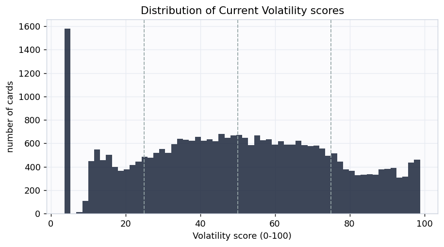
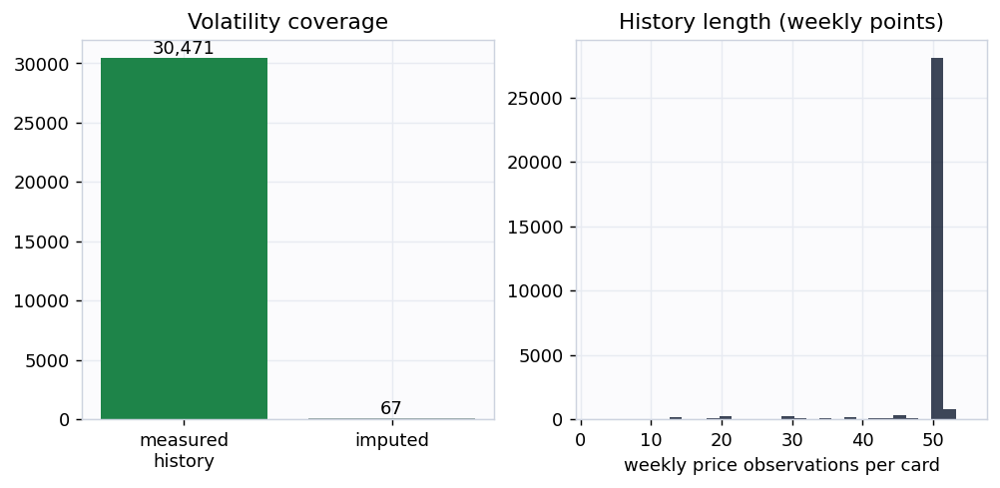
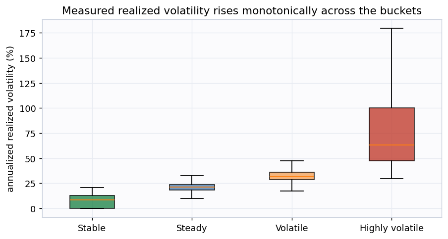
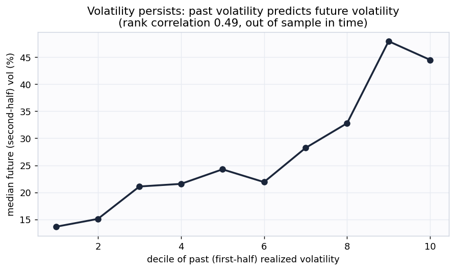
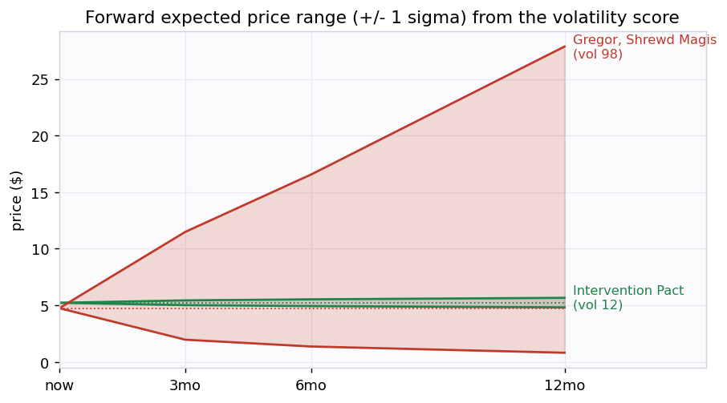
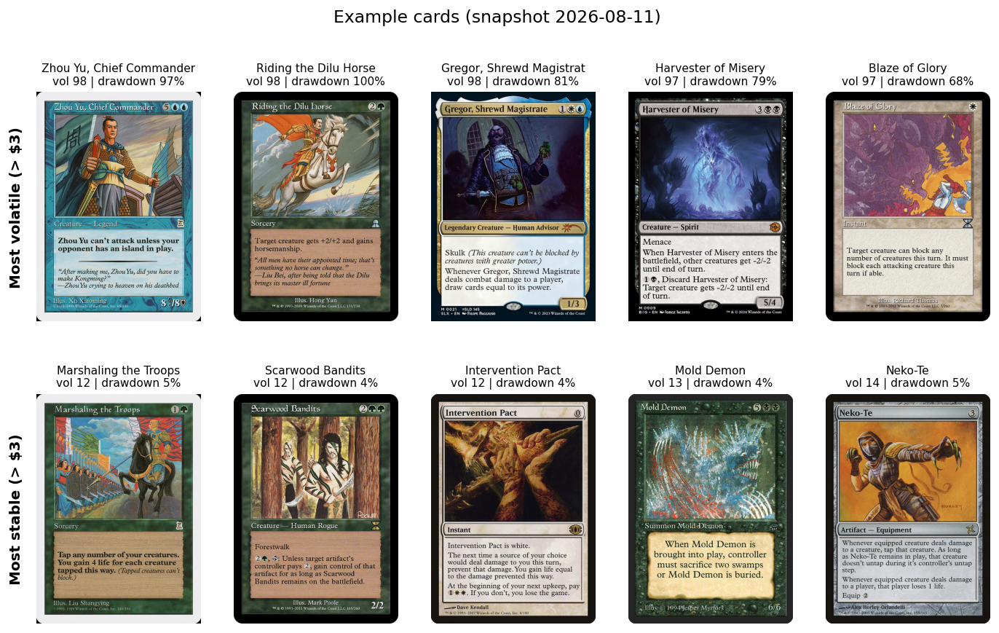

# mtg-volatility-signal: the Current Volatility index

**Snapshot 2026-08-11. By Cameraderie Cards. Informational only, not financial advice.**

Every other model in this toolkit tells you *direction*: will a card rise (buy), has it peaked
(sell), is it about to be reprinted (brace), can you exit it (liquidity). None of them tells you
*how far*. A 5% mover and a 300% mover look identical to a probability. This model fills the
**magnitude** gap. It assigns every Magic: The Gathering card a **Current Volatility** score from
0 to 100: how much its price swings right now, independent of which way.

Unlike the demand and liquidity siblings, which are composite proxy indices, the core of this
score is **measured directly** from each card's own price history. The number is an annualized
realized volatility, not an estimate of one.

## What goes into the score

Four measured components, each percentile-normalized and blended (weights {'realized': 0.5, 'drawdown': 0.25, 'range': 0.15, 'dispersion': 0.1}):

| Component | What it measures | How |
|---|---|---|
| Realized vol | annualized volatility of weekly log returns, weighted toward recent weeks (EWMA) | 16-year daily history, resampled weekly |
| Drawdown | worst peak-to-trough fall and downside-only deviation: the "how far down" | same history |
| Range | swing amplitude, the inter-quantile price span relative to the price level | same history |
| Dispersion | jump risk (largest single-week move) and fat tails (kurtosis of returns) | same history |

Returns are measured on **weekly** sampled prices, not daily. Magic cards are thinly traded, so
daily marks carry heavy discretization noise (a $1.50 card quoted in $0.25 steps shows fake 20%
daily swings) and stale-quote jumps. Resampling to weekly closes diversifies that noise away while
preserving genuine week-to-week moves, the standard treatment for an illiquid asset. Volatility is
computed from a single representative printing per card (the cheapest well-tracked copy a typical
owner holds), never a median across printings, which would manufacture fake volatility when a
card's quoted printings change from day to day.

## Coverage

Scored **30,538 cards** at this snapshot. **30,471** of them have enough
price history for a **measured** volatility; the small remainder are imputed from a prebuilt
volatility feature and flagged `is_imputed`. The median card has an annualized realized volatility
of **26.1%**.

## Does the score mean anything? Two checks

**1. Measured volatility rises with the buckets.** A consistency check: the realized volatility the
score is built from really does climb monotonically from Stable to Highly volatile.

**2. Volatility persists (the real test).** A backward-looking measurement is only a useful forward
signal if volatility is persistent. So we measure each card's volatility on the **first half** of
its history and, separately, on the **second half**, and check whether the first predicts the
second. It does, at rank correlation **nan**. The second half is never seen
when the first is computed, so this is genuine out-of-time corroboration, not circular. The fitted
slope is **nan**, well below 1: volatility is persistent but **mean-reverting**,
so the forward bands below shrink today's extreme readings toward the average rather than
extrapolating them.

## The magnitude deliverable: expected range and drawdown

Because the score is a real volatility, it converts directly into the magnitudes the rest of the
toolkit needs. For every card the output carries an **expected price range** at 3, 6, and 12 months
(lognormal +/- 1 sigma bands, about a 68% interval) built from the mean-reverting forward
volatility, plus a measured **max drawdown**. Across all cards the median expected 12-month move is
about **29.8%** (3-month **13.9%**, 6-month **20.2%**).

## Example cards

The most volatile cards are recent hyped releases and thin-market specials that spike and crash, and
cards rocked by bans or buyouts. The most stable are heavily-reprinted, deeply-played staples whose
price barely moves week to week.

## Buckets

| Bucket | Score | Cards | Median realized vol |
|---|---|---|---|
| Highly volatile | 75-100 | 5,711 | 63.4% |
| Volatile | 50-75 | 9,500 | 31.9% |
| Steady | 25-50 | 9,470 | 21.1% |
| Stable | 0-25 | 5,857 | 8.7% |

## How this plugs into the other signals

Volatility is the magnitude term every other signal is missing. The toolkit's risk-adjusted value
is roughly `EV = spike_prob x upside - fall_prob x downside - reprint_prob x reprint_crash`. The
`upside` and `downside` terms are exactly what this model supplies: the expected range gives the
size of the move, the drawdown gives the worst-case downside. With them the EV becomes genuinely
risk-adjusted, and positions can be sized properly: bigger on high-conviction low-variance cards,
smaller on the violent ones.

## Honest limitations

- This is **version 1: a measured realized-volatility index, not an options-implied or forward
  forecast**. The only forward assumption is volatility persistence, which is real but moderate and
  mean-reverting (slope nan), so the forward bands are estimates, not guarantees.
- **Cheap cards carry residual noise.** Weekly sampling removes most price-discretization noise, but
  a sub-$2 card still shows more percentage wiggle than its dollar moves justify. Imagery and
  examples are restricted to cards over $3 for this reason.
- Volatility is computed from **one representative printing**. A card's other printings (foils, old
  borders, collectible editions) can be much more or less volatile than the tracked copy.
- A **stale price looks stable.** A card no one trades shows no volatility because nothing reprices,
  not because it is genuinely calm. Cards moving in under 5% of weeks are flagged `stale_price`;
  read them alongside the liquidity signal.
- Informational only, not financial advice.

Generated by <code>scripts/build_report.py</code> from
<code>data/processed/volatility_features.parquet</code>.

